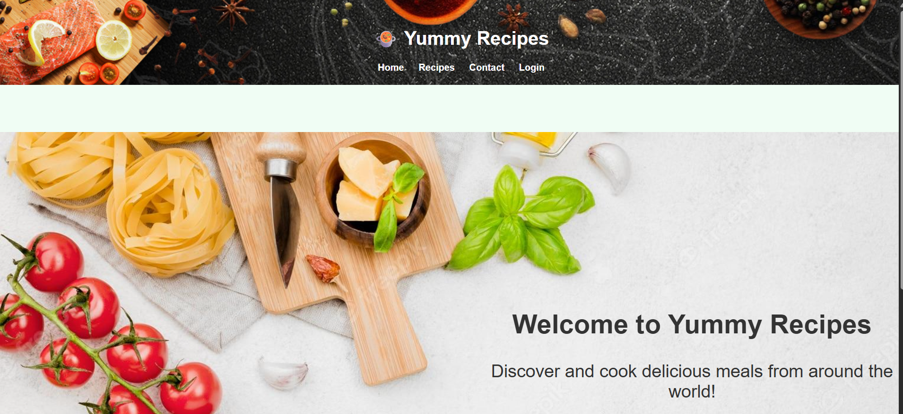
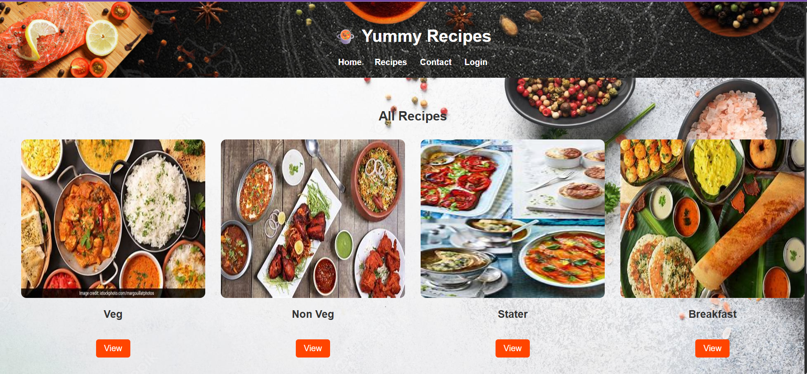
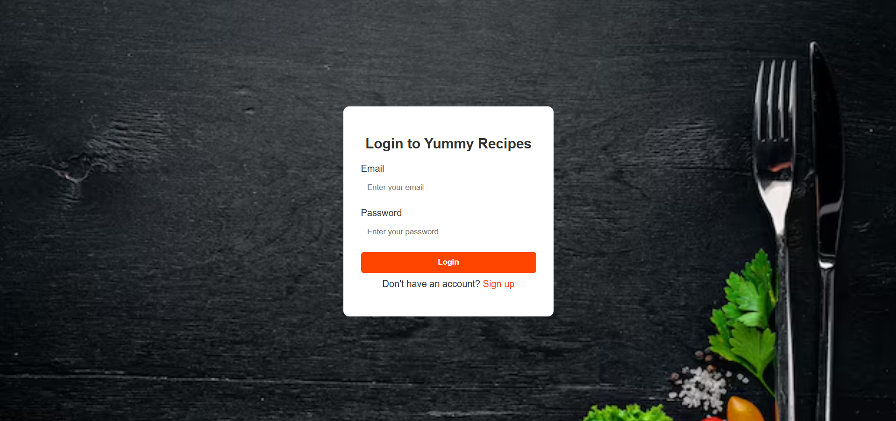

<!DOCTYPE html>
<html lang="en">
<head>
  <meta charset="UTF-8">
  <title>🍔 Food Website</title>
</head>
<body>

<h1>🍔 Food Website</h1>

A <b>responsive food website</b> built using <b>HTML, CSS, and JavaScript</b>. 
It showcases a restaurant-style design with modern UI, menu sections, and interactive features. 
Perfect for food delivery or restaurant landing pages.

<h2>📌 Project Objective</h2>
<ul>
  <li>Create an attractive restaurant/food ordering website</li>
  <li>Display different food categories with images</li>
  <li>Provide a responsive and mobile-friendly UI</li>
  <li>Add interactive elements using JavaScript</li>
</ul>

<h2>📊 Screenshots</h2>

<h3>Home Page</h3>

<h3>Recipe Section</h3>

<h3>Login Page</h3>

<h2>🛠️ Tools & Technologies</h2>
<ul>
  <li>Frontend: HTML5, CSS3, JavaScript</li>
  <li>Styling: CSS Flexbox, Grid, Animations</li>
  <li>Version Control: Git & GitHub</li>
  <li>IDE: VS Code</li>
</ul>

<h2>📂 Project Structure</h2>
<pre>
Food-Website/
│── index.html
│── style.css
│── script.js
│── images/
│   ├── homepage.png
│   ├── menu.png
│   ├── contact.png
│── README.html
</pre>

<h2>📌 Features</h2>
<ul>
  <li>Responsive home page with hero section</li>
  <li>Menu section with food categories and prices</li>
  <li>About Us and Contact form</li>
  <li>Smooth animations and hover effects</li>
  <li>Works on desktop, tablet, and mobile devices</li>
</ul>

<h2>🚀 How to Run Locally</h2>
<ol>
  <li>Clone the repository
    <pre>git clone https://github.com/yourusername/Food-Website.git</pre>
  </li>
  <li>Navigate to the project folder
    <pre>cd Food-Website</pre>
  </li>
  <li>Open <code>index.html</code> in your browser</li>
</ol>

<h2>🙋‍♂️ Author</h2>

<b>Soham Powar</b> 
B.Tech in Computer Science & Engineering 
GitHub: <a href="https://github.com/sohampowar">sohampowar</a> 
LinkedIn: <a href="https://www.linkedin.com/in/soham-powar-383593271/">Soham Powar</a>

</body>
</html>
